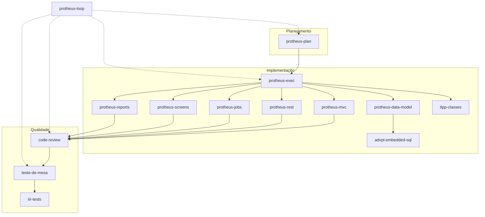

# Skills TOTVS Protheus (ADVPL/TLPP)

Coleção de **Agent Skills** para o Cursor: guias prescritivos que orientam o agente em tarefas de desenvolvimento, revisão, planejamento e testes no **TOTVS Protheus** usando **ADVPL** e **TLPP**.

Cada pasta contém um `SKILL.md` (instruções principais) e, quando aplicável, arquivos de referência (`references/`, `rules/`, dicionário de dados, etc.).

---

## Índice

- [Visão geral](#visão-geral)
- [Fluxo de trabalho](#fluxo-de-trabalho)
- [Skills por categoria](#skills-por-categoria)
  - [Linguagem e fundamentos](#linguagem-e-fundamentos)
  - [Acesso a dados](#acesso-a-dados)
  - [Padrões de implementação](#padrões-de-implementação)
  - [Módulos de negócio](#módulos-de-negócio)
  - [Planejamento e orquestração](#planejamento-e-orquestração)
  - [Qualidade e testes](#qualidade-e-testes)
- [Referência rápida](#referência-rápida)
- [Estrutura do repositório](#estrutura-do-repositório)

---

## Visão geral

| Pasta | Skill | Quando usar |
|-------|-------|-------------|
| `advpl-debugging` | advpl-debugging | Debugar, diagnosticar erros, logs, performance, locks |
| `advpl-embedded-sql` | advpl-embedded-sql | Queries novas com `BeginSQL/EndSQL` |
| `advpl-tlpp-language` | advpl-tlpp-language | Referência de funções nativas (sob demanda) |
| `advpl-tlpp-migration` | advpl-tlpp-migration | Migrar `.prw` procedural para `.tlpp` OOP |
| `business-modules` | business-modules | Regras de negócio dos módulos SIGA* |
| `code-review` | code-review | Revisão sistemática de código ADVPL/TLPP |
| `protheus-data-model` | protheus-data-model | Acesso a tabelas, índices, dicionário, queries |
| `protheus-exec` | protheus-exec | Executar plano aprovado (`/protheus-exec`) |
| `protheus-jobs` | protheus-jobs | Jobs, schedules, processos batch |
| `protheus-loop` | protheus-loop | Orquestrador completo (`/protheus-loop`) |
| `protheus-mvc` | protheus-mvc | Cadastros MVC (`FWFormModel`, `FWMBrowse`) |
| `protheus-plan` | protheus-plan | Planejar antes de codificar (`/protheus-plan`) |
| `protheus-reports` | protheus-reports | Relatórios, Excel, PDF |
| `protheus-rest` | protheus-rest | APIs REST (servidor e cliente) |
| `protheus-screens` | protheus-screens | Telas clássicas (não MVC puro) |
| `teste-de-mesa` | teste-de-mesa | Simulação estática linha a linha |
| `tir-tests` | tir-tests | Testes E2E de interface (TIR) |
| `tlpp-classes` | tlpp-classes | Templates de classes TLPP/ADVPL |

---

## Fluxo de trabalho



**Fluxo recomendado para features médias/grandes:**

1. `/protheus-plan` — levantamento, validação TDN e dicionário, plano em `plano-*.md`
2. Aprovação explícita do usuário
3. `/protheus-exec` — implementação step a step
4. `code-review` + `teste-de-mesa` (+ `tir-tests` se houver interface)

**Para tarefas complexas (3+ artefatos ou vários módulos):** use `/protheus-loop`, que encadeia plan → exec → teste de mesa → review em loop (máx. 3 iterações).

---

## Skills por categoria

### Linguagem e fundamentos

#### `advpl-debugging`

Diagnóstico sistemático de problemas no Protheus.

- **Ativar quando:** debugar, corrigir erros, analisar logs, stack traces, compilação, runtime, lentidão, locks.
- **Conteúdo:** metodologia Coletar → Classificar → Localizar → Reproduzir → Corrigir; guias por tipo de erro (compilação, runtime, performance, integração).
- **Arquivos:** `SKILL.md`

---

#### `advpl-embedded-sql`

Padrão **prioritário** para consultas SQL em código novo.

- **Ativar quando:** criar ou revisar queries com `BeginSQL/EndSQL`, JOINs, filtros complexos.
- **Conteúdo:** macros `%table:`, `%xfilial:`, `%notDel%`, sintaxe, performance e legibilidade.
- **Relacionamento:** complementa `protheus-data-model` (posicionamento e abertura de tabelas); `MpSysOpenQuery` fica como secundário para queries dinâmicas.
- **Arquivos:** `SKILL.md`

---

#### `advpl-tlpp-language`

Referência de funções nativas ADVPL/TLPP e xBase.

- **Ativar quando:** o usuário pedir sintaxe de função específica (ex.: `AScan`, `AEval`) ou a função for obscura.
- **Não ativar para:** código ADVPL comum — regras básicas (Local, húngaro, `GetArea`, `xFilial`, `Begin Sequence`) devem vir do contexto do projeto; funções triviais (`AllTrim`, `Len`, `AAdd`, etc.) não exigem esta skill.
- **Arquivos:** `SKILL.md`, `references/native-functions-extended.md`

---

#### `advpl-tlpp-migration`

Processo de modernização procedural → orientado a objetos.

- **Ativar quando:** migrar, converter ou modernizar `.prw` para `.tlpp`, refatorar funções em classes.
- **Conteúdo:** workflow em 7 etapas (Analisar → Identificar → Mapear → Aprovar → Gerar → Validar → Compilar).
- **Relacionamento:** templates de destino em `tlpp-classes`.
- **Arquivos:** `SKILL.md`

---

### Acesso a dados

#### `protheus-data-model`

Padrões obrigatórios de leitura/escrita em tabelas do Protheus.

- **Ativar quando:** qualquer código com `DbSeek`, `RecLock`, `DbSelectArea`, aliases, `xFilial`, dicionário (SX2/SX3/SX5/SIX), menção a tabelas (SA1, SC5, SD1, SE1, etc.).
- **Conteúdo:** posicionamento, índices, workareas; dicionário local em `dicionario/` como **fonte primária** de metadados (campos, tipos, índices, custom U*/Z*).
- **Arquivos principais:**
  - `SKILL.md` — regras e fluxos
  - `tabelas-modulos.md` — mapeamento tabela ↔ módulo
  - `references/dicionario-top200.md` — tabelas mais usadas
  - `references/atualizar-dicionario.md` — como sincronizar o dicionário a partir de export (SX2/SX3/SIX/SX7/SX9)
  - `scripts/sync_dicionario.py` — script de sync (`rebuild` / `merge`)
  - `dicionario/<letra>/<ALIAS>.json` — metadados por tabela (~11.000 arquivos)

**Atualizar dicionário:** export em `C:\Dicionário` → `python protheus-data-model/scripts/sync_dicionario.py --input-dir C:\Dicionário --mode rebuild` (detalhes em `references/atualizar-dicionario.md`).

**Delegação:** queries novas com SQL → `advpl-embedded-sql`.

---

### Padrões de implementação

#### `protheus-mvc`

Cadastros e rotinas no padrão MVC do Protheus (`MPFormModel` / `FWFormView`).

- **Ativar quando:** CRUD, `ModelDef`, `ViewDef`, `MenuDef`, `FWMBrowse`, master-detail, monitores.
- **Conteúdo:** Model 1 (cadastro simples), Model 2 (master-detail), Model 3 (múltiplos grids/abas), Model 4 (monitor/consulta virtual).
- **Arquivos:** `SKILL.md`

---

#### `protheus-screens`

Telas e browses **fora** do MVC puro.

- **Ativar quando:** `MsDialog`, `FWMarkBrowse`, `MsNewGetDados`, `ParamBox`, `EnchoiceBar`, `TDialog`, `TCBrowse`, grids editáveis.
- **Conteúdo:** templates de dialog, grid editável, seleção em massa, master-detail clássico.
- **Arquivos:** `SKILL.md`, `references/browse-examples.md`

---

#### `protheus-rest`

APIs REST no Protheus (servidor e cliente).

- **Ativar quando:** criar endpoints, consumir APIs externas, OAuth2/Bearer, JSON, `@Get`/`@Post`/`@Put`/`@Delete`.
- **Padrão integração:** 6 includes, doc `/* program/Funcao/... */`, `api-token` + `GetMV`, envelope `Code/Message/itens`, `User Function` + validadores + `BeginSQL`.
- **Conteúdo:** TLPP Class (CRUD), `WSRestful` (manutenção), `FWRest`, anti-patterns (`Return .F.` → HTTP 500).
- **Arquivos:** `SKILL.md`, `references/rest-integracao-template.md`

---

#### `protheus-jobs`

Processos agendados e batch sem interface.

- **Ativar quando:** Jobs, `Schedule`, `RpcSetEnv`, `LockByName`, workers, rotinas via Scheduler.
- **Conteúdo:** arquitetura obrigatória em 3 camadas (Entry + Lock/Orquestrador + Worker), `FwLogMsg`, `FWIPCWait`, concorrência.
- **Arquivos:** `SKILL.md`

---

#### `protheus-reports`

Relatórios e exportações.

- **Ativar quando:** relatórios, Excel, PDF, perguntas SX1, saída impressa.
- **Conteúdo:** `TReport` (padrão para código novo), `FwPrinterXlsx`, `FWMSPrinter`; evitar `SetPrint` em código novo.
- **Arquivos:** `SKILL.md`, `references/treport-examples.md`

---

#### `tlpp-classes`

Classes TLPP/ADVPL orientadas a objetos.

- **Ativar quando:** criar ou revisar classes (`Class`/`Method`/`Data`), controllers REST, domain, workers, SmartView.
- **Conteúdo:** templates obrigatórios, nomenclatura, propriedades, construtores, herança vs composição, anti-patterns.
- **Relacionamento:** destino da migração em `advpl-tlpp-migration`; usada também em revisões classificadas como OOP em `code-review`.
- **Arquivos:** `SKILL.md`

---

### Módulos de negócio

#### `business-modules`

Conhecimento funcional dos principais módulos SIGA*.

- **Ativar quando:** dúvidas sobre compras, faturamento, financeiro, estoque, fiscal, contabilidade, manutenção ou PCP.
- **Conteúdo:** orquestrador que aponta para até **2 arquivos de módulo** por consulta; tabelas, rotinas, pontos de entrada e integrações entre módulos.
- **Arquivos:**

| Arquivo | Módulo |
|---------|--------|
| `compras.md` | Compras (COM) — SC1, SC7, SD1, SF1, SA2… |
| `faturamento.md` | Faturamento (FAT) — SC5, SC6, SF2, SD2, SA1… |
| `financeiro.md` | Financeiro (FIN) — SE1, SE2, SE5… |
| `estoque.md` | Estoque (EST) — SB1, SB2, SD3… |
| `fiscal.md` | Fiscal (FIS) — SF3, SF4, SFT… |
| `contabilidade.md` | Contabilidade (CTB) — CT1, CT2… |
| `manutencao.md` | Manutenção de Ativos (MNT) |
| `pcp.md` | PCP — SC2, SD4, SG1… |
| `SKILL.md` | Roteamento e integrações |

---

### Planejamento e orquestração

#### `protheus-plan`

Arquitetura de solução **antes** de codificar (`/protheus-plan`).

- **Ativar quando:** feature nova, refatoração estrutural, necessidade de plano validado.
- **Fases:** requisitos → componentes (tabelas, funções, artefatos) → validação TDN → validação dicionário → carregar skills de implementação → gerar `plano-*.md`.
- **Saída:** plano com steps, dependências, riscos e referências às skills corretas (MVC, REST, Job, etc.).
- **Arquivos:** `SKILL.md`

---

#### `protheus-exec`

Executor mecânico do plano (`/protheus-exec`).

- **Ativar quando:** existir `plano-*.md` aprovado pelo usuário.
- **Conteúdo:** localizar plano, executar steps em ordem, respeitar dependências, aplicar templates das skills especializadas.
- **Não substitui:** planejamento (`protheus-plan`) nem revisão (`code-review`).
- **Arquivos:** `SKILL.md`

---

#### `protheus-loop`

Orquestrador de ciclo completo (`/protheus-loop`).

- **Ativar somente quando:** o usuário invocar explicitamente; tarefa com 3+ artefatos distintos ou mudança estrutural multi-módulo.
- **Não usar para:** bug fix isolado, campo simples, revisão pontual.
- **Fluxo:** `protheus-plan` → aprovação → loop (`protheus-exec` → `teste-de-mesa` → `code-review`) até aprovação ou 3 iterações.
- **Modo:** sequencial, sem subagents; não escreve código diretamente.
- **Arquivos:** `SKILL.md`

---

### Qualidade e testes

#### `code-review`

Revisão sistemática em quatro dimensões.

- **Ativar quando:** revisar PR, fonte ADVPL/TLPP, pedido de code review.
- **Categorias:** segurança, performance, boas práticas, modernização.
- **Comportamento:** classifica o tipo de fonte (Job, REST, MVC, Report, Tela, Classe) e aplica a skill especializada correspondente; **sempre** inclui `protheus-data-model` quando há acesso a dados.
- **Arquivos:** `SKILL.md`, `rules/security.md`, `rules/performance.md`, `rules/best-practices.md`, `rules/modernization.md`

---

#### `teste-de-mesa`

Análise estática com rastreamento linha a linha (sem subir ambiente).

- **Ativar quando:** pedido explícito — "teste de mesa", "rastreia essa função", "simula a execução", `/teste-de-mesa`, análise profunda de bug.
- **Não ativar para:** "o que essa função faz?" ou explicação superficial.
- **Conteúdo:** estado de variáveis, fluxo, chamadas, retornos, falhas silenciosas, branches não cobertos.
- **Arquivos:** `SKILL.md`

---

#### `tir-tests`

Testes automatizados de interface (TOTVS Interface Robot).

- **Ativar quando:** testes E2E, regressão de tela, WebApp, gerar `TESTCASE.py`.
- **Não usar para:** jobs/backend sem UI (usar validação direta no servidor).
- **Conteúdo:** scripts Python/unittest, Selenium/Firefox, interação como usuário no Protheus WebApp.
- **Arquivos:** `SKILL.md`

---

## Referência rápida

### Qual skill usar?

| Necessidade | Skill |
|-------------|-------|
| Planejar feature | `protheus-plan` |
| Implementar plano aprovado | `protheus-exec` |
| Ciclo plan → dev → QA → review | `protheus-loop` |
| Cadastro MVC / FWMBrowse | `protheus-mvc` |
| Tela dialog / browse clássico | `protheus-screens` |
| API REST | `protheus-rest` |
| Job / schedule | `protheus-jobs` |
| Relatório / Excel / PDF | `protheus-reports` |
| Tabela / DbSeek / alias | `protheus-data-model` |
| Query SQL nova | `advpl-embedded-sql` |
| Classe TLPP | `tlpp-classes` |
| Migrar .prw → .tlpp | `advpl-tlpp-migration` |
| Regra de negócio SIGA* | `business-modules` |
| Revisar código | `code-review` |
| Simular execução sem rodar | `teste-de-mesa` |
| Teste automatizado de tela | `tir-tests` |
| Erro / log / performance | `advpl-debugging` |
| Sintaxe de função nativa | `advpl-tlpp-language` |

### Dependências entre skills

```
protheus-plan
    ├── business-modules (módulo de negócio)
    ├── protheus-data-model (tabelas/campos)
    └── skills de implementação (mvc, rest, jobs, …)

protheus-exec → usa templates das skills de implementação

code-review → protheus-data-model (sempre que houver DB)
             → skill do tipo detectado (mvc, rest, jobs, …)

advpl-tlpp-migration → tlpp-classes (templates OOP)

protheus-data-model → advpl-embedded-sql (queries novas)
```

---

## Estrutura do repositório

```
skills/
├── README.md                    ← este arquivo
│
├── advpl-debugging/
├── advpl-embedded-sql/
├── advpl-tlpp-language/
│   └── references/
├── advpl-tlpp-migration/
│
├── business-modules/
│   ├── SKILL.md
│   └── *.md                     (8 módulos de negócio)
│
├── code-review/
│   ├── SKILL.md
│   └── rules/                   (security, performance, …)
│
├── protheus-data-model/
│   ├── SKILL.md
│   ├── tabelas-modulos.md
│   ├── scripts/
│   │   └── sync_dicionario.py   (sync dicionario/ a partir de C:\Dicionário)
│   ├── references/
│   │   ├── dicionario-top200.md
│   │   └── atualizar-dicionario.md
│   └── dicionario/              (~11.000 JSON por alias)
│
├── protheus-plan/
├── protheus-exec/
├── protheus-loop/
│
├── protheus-mvc/
├── protheus-screens/
│   └── references/
├── protheus-rest/
│   └── references/
│       └── rest-integracao-template.md
├── protheus-jobs/
├── protheus-reports/
│   └── references/
│
├── tlpp-classes/
├── teste-de-mesa/
└── tir-tests/
```

---

## Como usar no Cursor

### Instalação (escopo pessoal — todos os projetos)

As skills podem ficar em pasta **ou** ser gerenciadas em **Cursor Settings → Rules, Skills, Subagents** (a UI lista os mesmos arquivos em disco).

**Caminhos oficiais:**

| Escopo | Caminho Windows |
|--------|-----------------|
| Pessoal | `%USERPROFILE%\.cursor\skills\<nome-da-skill>\` |
| Projeto | `<repo>\.cursor\skills\<nome-da-skill>\` |

**Junctions já configurados** (fonte: `d:\skills` → destino: `%USERPROFILE%\.cursor\skills\`):

```powershell
# Recriar junctions (se necessário em outra máquina)
$skillsRoot = "d:\skills"
$cursorSkills = "$env:USERPROFILE\.cursor\skills"
Get-ChildItem $skillsRoot -Directory | Where-Object { Test-Path "$($_.FullName)\SKILL.md" } | ForEach-Object {
  $target = Join-Path $cursorSkills $_.Name
  if (-not (Test-Path $target)) {
    New-Item -ItemType Junction -Path $target -Target $_.FullName | Out-Null
  }
}
```

Edite os arquivos em `d:\skills` — as alterações refletem automaticamente nas skills do Cursor.

### Uso no chat

1. O agente carrega o `SKILL.md` relevante conforme a `description` no frontmatter.
2. Invoque manualmente com `/nome-da-skill` (ex.: `/protheus-plan`).
3. Fluxos guiados:
   - `/protheus-plan` — planejamento
   - `/protheus-exec` — execução do plano
   - `/protheus-loop` — ciclo completo
   - `/teste-de-mesa` — análise estática profunda

4. Confira em **Settings → Rules, Skills, Subagents → Skills** se as 18 skills Protheus aparecem na lista.

---

## Contribuição

Ao adicionar ou alterar uma skill:

1. Mantenha o frontmatter YAML (`name`, `description`) claro — é o que o agente usa para decidir ativação.
2. Indique **quando usar** e **quando não usar** para evitar ativação indevida.
3. Referencie skills relacionadas em seção de cross-references.
4. Atualize este `README.md` se o escopo da skill mudar.
